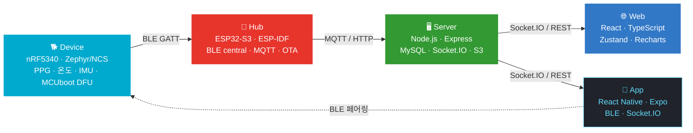
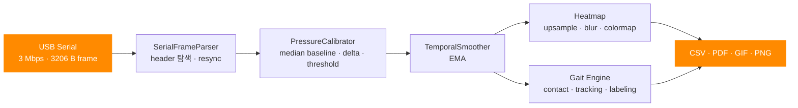

**Product Engineer** — 웹 · 모바일 · 백엔드 · 펌웨어를 하나의 제품으로 연결합니다. 
현재 크림오프(cream-off)에서 반려동물 생체신호 모니터링 제품 **TalkTail**을 만들고 있습니다.

 

## 🧩 Tech Stack

<table>
<tr>
<td align="right"><b>Frontend</b></td>
<td>
&nbsp;

</td>
</tr>
<tr>
<td align="right"><b>Mobile</b></td>
<td>
&nbsp;

</td>
</tr>
<tr>
<td align="right"><b>Backend</b></td>
<td>
&nbsp;

</td>
</tr>
<tr>
<td align="right"><b>Firmware</b></td>
<td>
&nbsp;

</td>
</tr>
<tr>
<td align="right"><b>Ops</b></td>
<td>
&nbsp;

</td>
</tr>
</table>

 

## 🚀 Featured Projects

<table>
<tr>
<td width="50%" valign="top">

### 🐾 TalkTail Gait Viewer

40×40 USB-Serial 압력 매트를 실시간 히트맵으로 그리고, 기록한 보행 데이터로 반려견 보행 분석을 수행하는 뷰어. Qt6/C++ 수집 프로그램을 TypeScript로 재구현해 **브라우저(Web Serial)와 Electron이 같은 파이프라인**을 씁니다.

- 3 Mbps 시리얼 프레임 파싱 · header resync · 부분 프레임 처리
- per-cell median 베이스라인 캘리브레이션 · EMA 스무딩
- Canvas 히트맵 (upsample → Gaussian blur → colormap)
- 보행 엔진: Hungarian tracking · contact hysteresis · CoP 기반 방향 · LF/RF/LH/RH 라벨링
- CSV · PDF · GIF · PNG export (PDF writer · GIF 인코더 직접 구현)
- `node --test` 41개 · electron-builder Win/mac 배포

</td>
<td width="50%" valign="top">

### 🐶 TalkTail Platform

웨어러블(PPG · 온도 · IMU) → BLE → 허브 → MQTT → 서버 → 웹/앱으로 이어지는 실시간 IoT 플랫폼. 프론트엔드 · 백엔드 · 모바일 앱을 주로 담당하고 허브·디바이스 펌웨어 작업에 참여합니다.

- **Web** — 실시간 생체 차트, 디바이스/허브 관리, i18n, 브라우저 펌웨어 플래싱(esptool-js)
- **Backend** — 허브 제어 API, MQTT 연동, Socket.IO 브로드캐스트, JWT, S3, OTA 배포 API
- **App** — BLE 페어링 · Wi-Fi 프로비저닝 · 실시간 스트리밍 · 푸시 알림
- **Contract** — BLE / MQTT / REST / Socket / OTA 계약 문서화, 무유실 전송(seq + ACK + 재전송 + dedup)
- **Firmware** — ESP32-S3 허브(BLE client · MQTT · OTA), nRF5340 디바이스(BLE 서비스 · 센서 · DFU)

</td>
</tr>
</table>

 

## 🏗️ TalkTail Architecture

 

## 🎯 Engineering Focus

<table>
<tr>
<td align="center" width="25%"><h3>🖥️</h3><b>Frontend</b> React + TypeScript 상태 소유권 · 데이터 시각화 Electron 데스크톱</td>
<td align="center" width="25%"><h3>⚙️</h3><b>Backend</b> Express REST · 인증/인가 MySQL · Socket.IO / MQTT PM2 운영</td>
<td align="center" width="25%"><h3>📱</h3><b>Mobile</b> React Native · Expo BLE · Wi-Fi 프로비저닝 백그라운드 알림</td>
<td align="center" width="25%"><h3>🔌</h3><b>Embedded</b> ESP-IDF · Zephyr BLE GATT · OTA / DFU 센서 파이프라인</td>
</tr>
</table>

 

## 📂 Selected Repositories

| Project | Description | Stack |
|---|---|---|
| [**talktail_gait_web**](https://github.com/bu-xl/talktail_gait_web) | 압력 매트 실시간 히트맵 + 반려견 보행 분석 뷰어 |    |
| [**server-monitor**](https://github.com/bu-xl/server-monitor) | Ubuntu 서버 오류·상태를 매일 00시에 정리해 이메일로 보내는 데몬 |    |
| [**h100_fastapi**](https://github.com/bu-xl/h100_fastapi) | Image-to-Image AI 웹 서비스 (Z-Image-Turbo) |    |
| [**kitae-backend**](https://github.com/bu-xl/kitae-backend) | 패션 이커머스 백엔드 — 인증 · 상품 · 장바구니 · 주문 |    |
| [**inventory-management_backend**](https://github.com/bu-xl/inventory-management_backend) | 재고 관리 API |    |
| [**print**](https://github.com/bu-xl/print) | 프린터 목록 조회·출력용 Windows 서비스, exe 패키징 |   |
| [**gap-cli**](https://github.com/bu-xl/gap-cli) | `git add · commit · push`를 한 줄로 끝내는 CLI |  |

 

## 📊 GitHub Activity

  

 

## 💬 Development Philosophy

> **Make the architecture simple enough to understand, and robust enough to survive production.**

<table>
<tr>
<td>🔒 <code>any</code> 대신 명시적 타입</td>
<td>👁️ 데이터 흐름은 관찰 가능하게</td>
<td>🧱 도메인 로직과 렌더링 분리</td>
</tr>
<tr>
<td>📐 클라이언트를 붙이기 전에 API 계약부터</td>
<td>⏱️ 측정한 뒤에 최적화</td>
<td>🔗 하드웨어 · 백엔드 · 프론트엔드를 하나의 시스템으로</td>
</tr>
</table>

